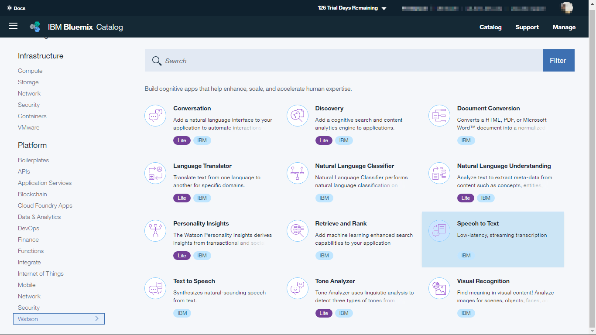
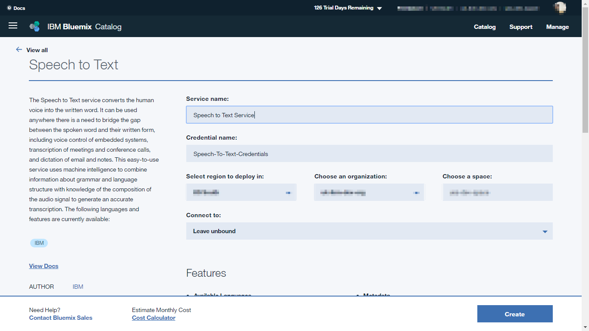
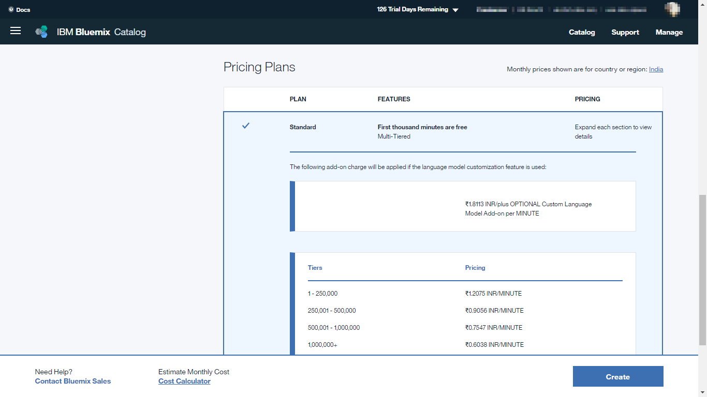
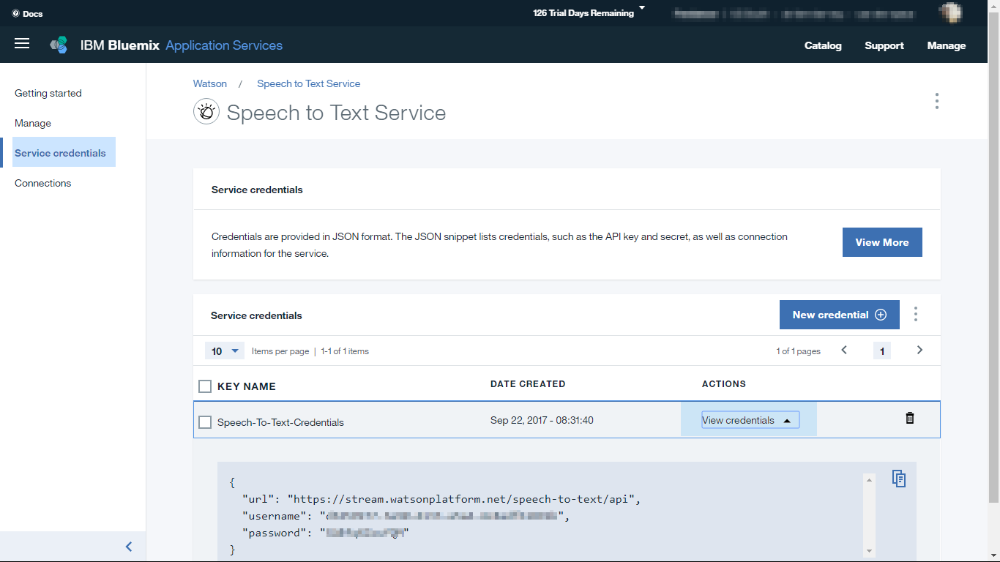
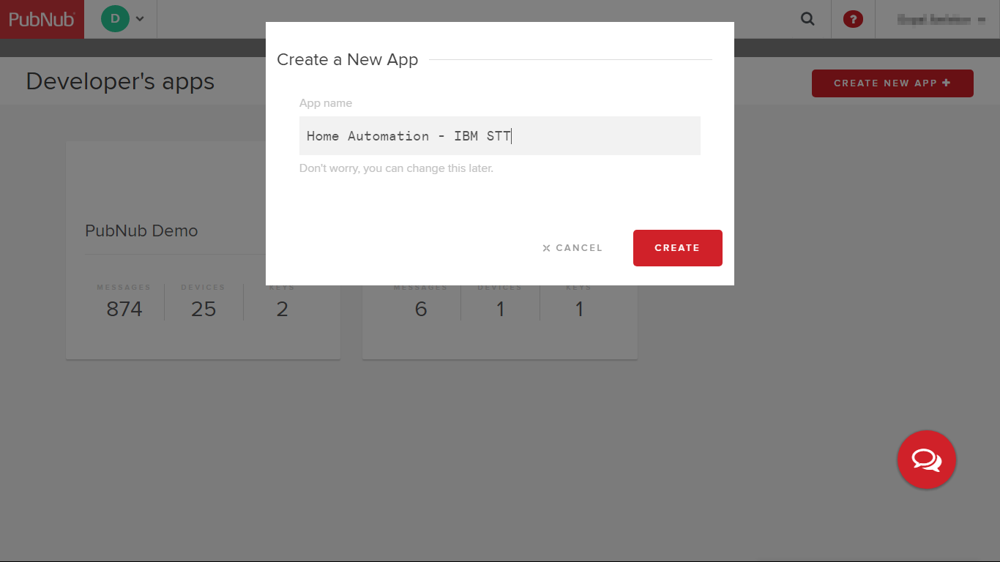
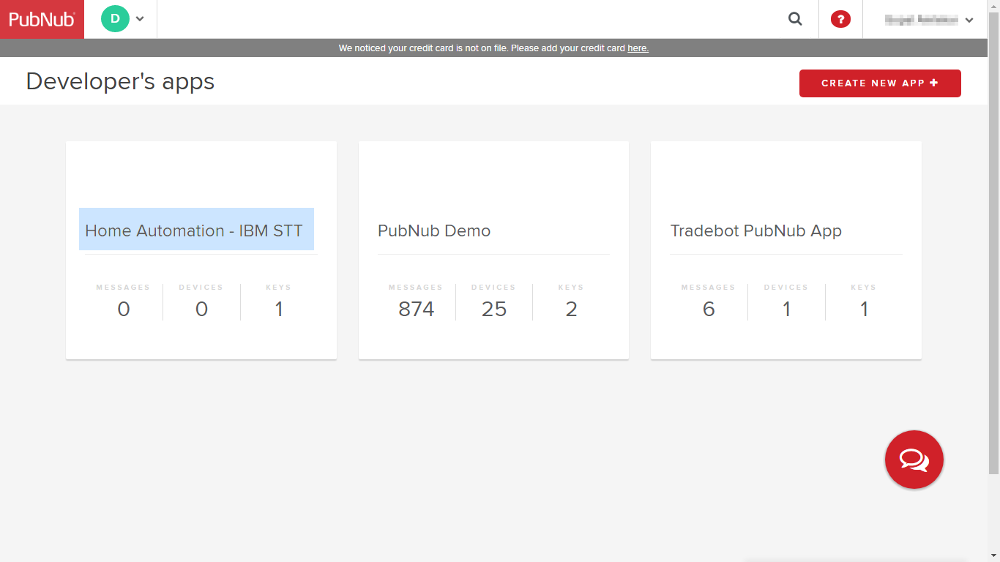
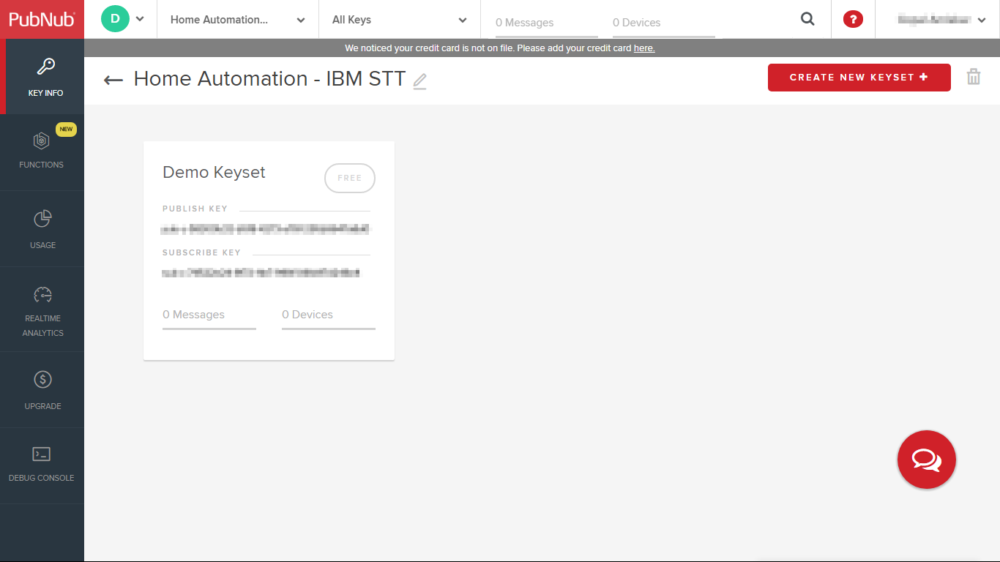
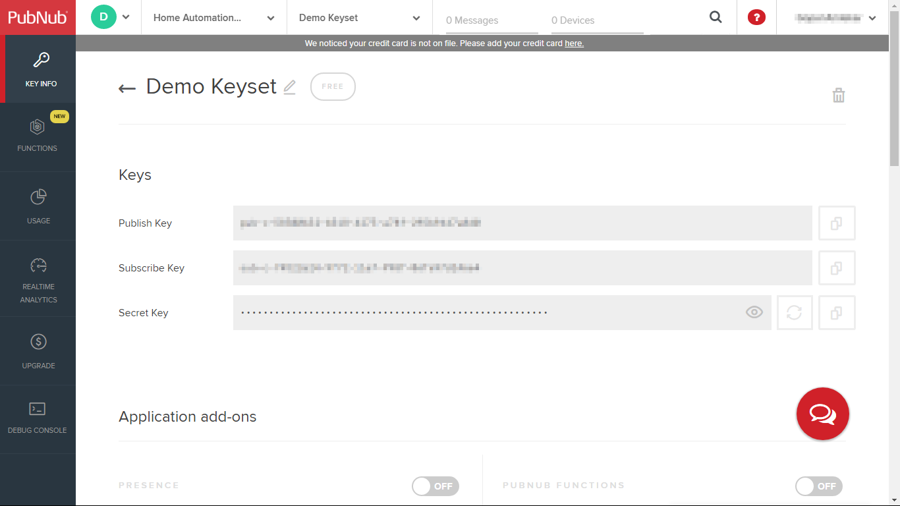

### Voice controlled Home Automation powered by Watson Speech to Text
A demo app for voice controlled home automation using IBM Watson Speech to Text and PubNub

#### Setup

Before you get started with this app, you need your own IBM ID and a developer account on PubNub. Once you have created these accounts, follow the steps below to build and run this app.


##### Setup IBM Speech to Text Service


###### Step 1


Log on to [IBM Bluemix](https://console.bluemix.net/) with your IBM ID. Go to catalog, then select **Speech to Text** under Watson services.





###### Step 2:


Enter a name for the service and the service credential. Leave the field 'Connect to' as 'Leave unbound'.





Scroll down and select 'Standard pricing plan' and then click on 'Create'.





###### Step 3:

From the service page, go to 'Service credentials' and click on 'View credentials'. It will show a json object with url, username and password for your service.
The username and password are unique to your service instance created. Make note of these as we will use them later while setting up the PubNub function.





##### Setup PubNub


###### Step 4:

Login to [PubNub admin portal](https://admin.pubnub.com) with your PubNub account.


###### Step 5:

From the dashboard, create a new app by clicking on 'CREATE NEW APP +' and give some name to your app.





###### Step 6:


Your PubNub app is created now.





Click on this newly created app. A demo keyset is already created for you.





Click on the keyset and copy both the publish and subscribe keys. We will need them while running the app.





##### Setup Local server and run the app

After creating the Watson Speech to Text service on IBM Bluemix and an app on PubNub, it is time to build and run the app locally.

###### Step 7:

Make sure you have the following installed on your computer:

1. [Node.js V6.11.1+](https://nodejs.org/en/)
2. [git V2.14.1+](https://git-scm.com/downloads)

Also make sure that git and node, npm are available in your path.

###### Step 8:

Clone or download this git repo and navigate to the folder '[sttserver](/sttserver)'.

###### Step 9:

Install required modules.
```
npm install
```
This will install the required modules using node package manager (npm). A few modules are also installed using bower package manager.

###### Step 10:

Configure your local environment.
a) Create a text file in the same folder (*sttserver*) and name it as **‘.env’.** Populate the file with your IBM Watson Speech to Text service credentials (obtained in step 3 above) as shown below.

```
SPEECH_TO_TEXT_USERNAME='YOUR_WATSON_SPEECH_TO_TEXT_CREDENTIAL_USERNAME'
SPEECH_TO_TEXT_PASSWORD='YOUR_WATSON_SPEECH_TO_TEXT_CREDENTIAL_PASSWORD'
```

b) Open the file ['sttserver/static/scripts/env.js'](sttserver/static/scripts/env.js) and add your PubNub publish and subscribe keys (obtained in step 6 above) to it. The completed file should look like this.
```
PUB_NUB_PUBLISH_KEY= 'YOUR_PUBNUB_PUBLISH_KEY'
PUB_NUB_SUBSCRIBE_KEY= 'YOUR_PUBNUB_SUBSCRIBE_KEY'
PUB_NUB_CHANNEL_KEY= 'stt_channel'
```

###### Step 11:

Run the server now. This should output a message that the server is now started on http://localhost:3000.

```
npm start
```

###### Step 12:

Open the link shown in earlier step (http://localhost:3000 or http://127.0.0.1:3000) in your browser.


The app is now ready to accept speech commands. We now need to open the home simulator to experience the demo. Keep the server running.

###### Step 13:

Navigate to the folder ['homesimulator/scripts'](/homesimulator/scripts) and open the file ['homesimulator/scripts/env.js'](/homesimulator/scripts/env.js) in your favourite editor.

Add your PubNub publish and subscribe keys in this file and save the file. The channel name is already populated in this file so you need to add only the PubNub publish and subscribe keys. The channel name is same as the one used earlier in the '.env' file in step 10. Note that channel names are case sensitive so make sure that the same name is used in both the files. In fact, contents of this file are the same as this file is the same as ['sttserver/static/scripts/env.js'](sttserver/static/scripts/env.js).

Your Completed 'env.js' file should look like this:

```
PUB_NUB_PUBLISH_KEY= 'YOUR_PUBNUB_PUBLISH_KEY'
PUB_NUB_SUBSCRIBE_KEY= 'YOUR_PUBNUB_SUBSCRIBE_KEY'
PUB_NUB_CHANNEL_KEY= 'stt_channel'
```

###### Step 14:

Open the file [homeView.html](/homesimulator/homeView.html) in another window of the web browser. This should show image of a simulated home.


You should now have two browser windows open:
- Home page for the local server running as described in step 12.
- Homeview.html from the homesimulator folder.


It is not necessary to open both the windows on same computer. You can have the server running on one computer and the home simulator on another computer.

###### Step 15:

Go back to the server home page and click on button **Speak**. You may be asked for permission to use the microphone. Grant the permission and speak some voice command such as 'Can you please switch on bedroom light?' or 'Please turn off portico light' and so on.

If you now see the webpage showing simulated home, you should see the bulbs in individual rooms simulated on / off.


Supported commands are:

* Turn on Living Room light. / Turn off Living Room light.
* Turn on Kitchen light. / Turn off Kitchen light.
* Turn on Bedroom light. / Turn off Bedroom light.
* Turn on Portico light. / Turn off Portico light.
* Turn on Children room light. / Turn off Children room light.

Instead of 'Turn on/off', you can also use 'Switch on/off'. For example, 'Switch on children room light'.
